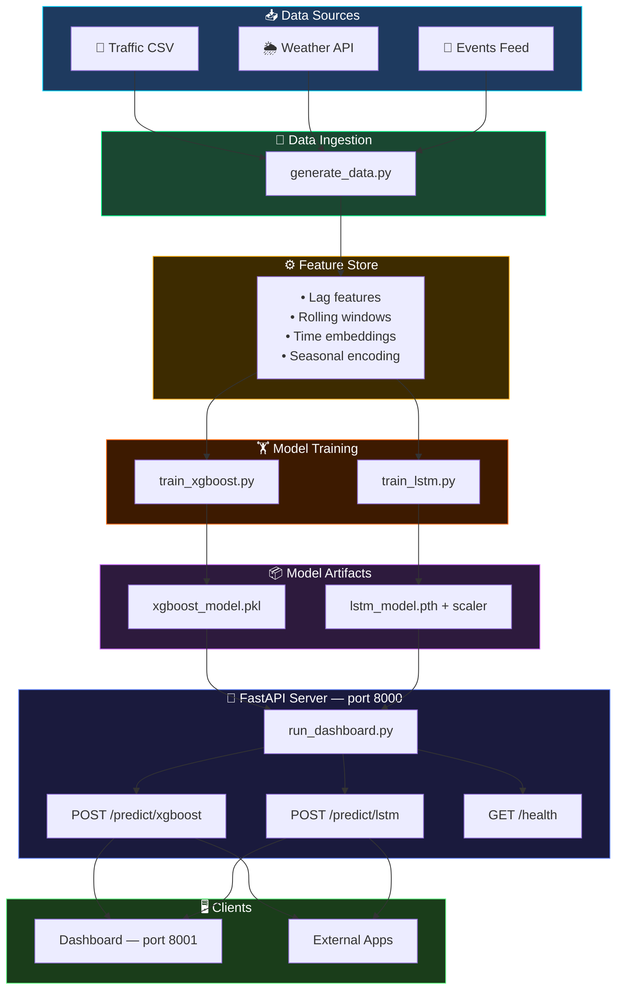
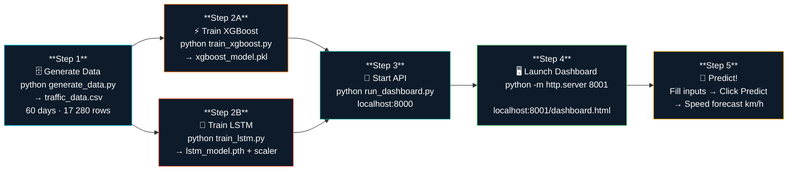
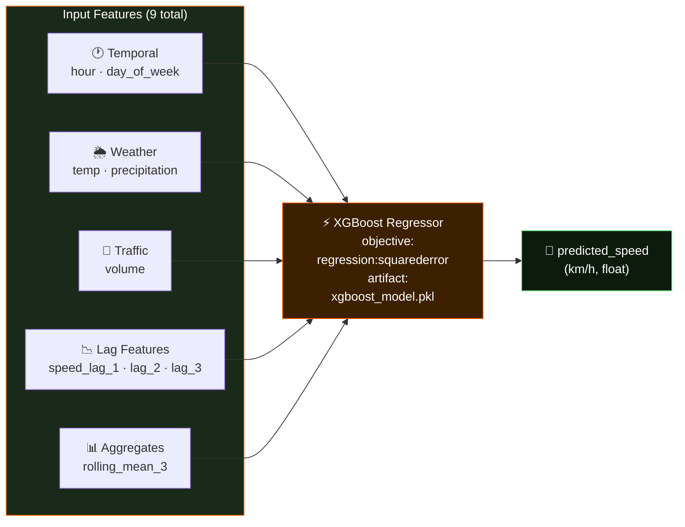
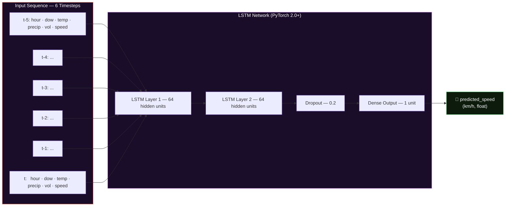

<div align="center">


<br/>


<br/><br/>

[](https://python.org)
[](https://fastapi.tiangolo.com)
[](https://pytorch.org)
[](https://xgboost.ai)
[](https://opensource.org/licenses/MIT)

<br/>

[](https://github.com/LuthandoCandlovu/TrafficPrediction)
[](https://github.com/LuthandoCandlovu/TrafficPrediction)
[](https://github.com/LuthandoCandlovu/TrafficPrediction/issues)

</div>

---

## 🌆 What is Smart City Traffic Prediction?

<div align="center">
  
</div>

<br/>

> **Smart City Traffic Prediction** is an end-to-end machine learning system that forecasts urban traffic speed in real time — helping city planners, commuters, and smart city platforms make faster, data-driven decisions about road congestion.

Urban traffic congestion costs billions in lost productivity every year. This project tackles that problem by combining two powerful ML models — **XGBoost** (lightning-fast tabular predictions) and **LSTM** (deep learning for time-series patterns) — into a hybrid forecasting engine that predicts the average traffic speed for the next 5-minute interval at any road sensor.

### 🔑 How it works at a glance:

- 📊 **Ingests** 60 days of traffic data (speed, volume) fused with weather signals (temperature, precipitation)
- ⚙️ **Engineers** temporal lag features, rolling windows, and time embeddings
- 🧠 **Trains** an XGBoost regressor and a 2-layer LSTM neural network in parallel
- 🚀 **Serves** both models through a production-ready **FastAPI** REST API
- 🖥️ **Visualises** live predictions through an interactive **HTML dashboard** — zero setup required

Whether you're a researcher exploring hybrid ML architectures, a developer building smart city integrations, or a data scientist benchmarking traffic models — this project gives you a fully working, end-to-end foundation.

---

## 📌 Table of Contents

<details>
<summary>Click to expand</summary>

- [✨ Features](#-features)
- [🏗️ Architecture](#️-architecture)
- [🔄 Workflow](#-workflow)
- [🚀 Quick Start](#-quick-start)
- [📊 API Reference](#-api-reference)
- [🧠 ML Models](#-ml-models)
- [🖥️ Dashboard](#️-dashboard)
- [🗄️ Data Sources](#️-data-sources)
- [📁 Project Structure](#-project-structure)
- [🤝 Contributing](#-contributing)
- [📄 License](#-license)

</details>

---

## ✨ Features

<div align="center">

| 🔮 | 🧠 | 🌦️ | 🌐 | 🖥️ | 📊 |
|:---:|:---:|:---:|:---:|:---:|:---:|
| **Traffic Speed Prediction** | **Hybrid ML Models** | **Weather Integration** | **REST API** | **Live Dashboard** | **Data Generator** |
| Predicts avg speed for next 5-min interval | XGBoost + LSTM ensemble | Temp, precipitation & more | FastAPI + CORS, production-ready | HTML/JS frontend, zero setup | 60 days of synthetic data |

</div>

<div align="center">
  
</div>

---

## 🏗️ Architecture



---

## 🔄 Workflow



---

## 🚀 Quick Start

### Prerequisites

- Python **3.8 or higher**
- Git
- Terminal (PowerShell / bash / zsh)

### Installation

**1. Clone the repository**
```bash
git clone https://github.com/LuthandoCandlovu/TrafficPrediction.git
cd TrafficPrediction
```

**2. Create & activate a virtual environment**
```bash
# Create
python -m venv venv

# Activate — macOS / Linux
source venv/bin/activate

# Activate — Windows
venv\Scripts\activate
```

**3. Install dependencies**
```bash
pip install -r requirements.txt
```

> Don't have `requirements.txt`? Generate one:
> ```bash
> pip install fastapi uvicorn torch xgboost pandas scikit-learn numpy
> pip freeze > requirements.txt
> ```

**4. Generate data** *(optional — default CSV is included)*
```bash
python generate_data.py
```

**5. Train the models** *(or use the pre-trained ones in the repo)*
```bash
python train_xgboost.py
python train_lstm.py
```

**6. Run the system**

Open two terminals side by side:

```bash
# Terminal 1 — API backend
python run_dashboard.py
```

```bash
# Terminal 2 — Frontend server
python -m http.server 8001
```

**7. Open your browser**
```
http://localhost:8001/dashboard.html
```

---

## 📊 API Reference

### `POST /predict/xgboost`

> Predicts traffic speed from 9 tabular features.

**Request**
```json
{
  "features": {
    "hour": 17,
    "day_of_week": 3,
    "weather_temp": 22.5,
    "weather_precip": 0.0,
    "volume": 180,
    "speed_lag_1": 45,
    "speed_lag_2": 48,
    "speed_lag_3": 52,
    "rolling_mean_3": 48.33
  }
}
```

**Response**
```json
{
  "predicted_speed": 43.2
}
```

---

### `POST /predict/lstm`

> Predicts traffic speed from a sequence of 6 consecutive timesteps.

**Request**
```json
{
  "features": [
    { "hour": 17, "day_of_week": 3, "weather_temp": 22.5, "weather_precip": 0, "volume": 180, "speed": 45 },
    { "hour": 17, "day_of_week": 3, "weather_temp": 22.5, "weather_precip": 0, "volume": 182, "speed": 44 },
    { "hour": 17, "day_of_week": 3, "weather_temp": 22.5, "weather_precip": 0, "volume": 185, "speed": 43 },
    { "hour": 17, "day_of_week": 3, "weather_temp": 22.5, "weather_precip": 0, "volume": 188, "speed": 42 },
    { "hour": 17, "day_of_week": 3, "weather_temp": 22.5, "weather_precip": 0, "volume": 190, "speed": 41 },
    { "hour": 17, "day_of_week": 3, "weather_temp": 22.5, "weather_precip": 0, "volume": 192, "speed": 40 }
  ]
}
```

**Response**
```json
{
  "predicted_speed": 40.1
}
```

---

## 🧠 ML Models

<div align="center">
  
</div>

### ⚡ XGBoost — Tabular Gradient Boosting



### 🧠 LSTM — Deep Sequence Learning



---

## 🖥️ Dashboard

<div align="center">
  

  <br/>

  > 💡 **Pro tip:** Replace this GIF with a screen recording of your own running dashboard!
  > Use [ScreenToGif](https://www.screentogif.com/) on Windows or [Kap](https://getkap.co/) on Mac, then drag-and-drop it into this README on GitHub.
</div>

<br/>

The dashboard serves two interactive prediction cards at `http://localhost:8001/dashboard.html`:

```
┌─────────────────────────────────────────────────────────┐
│              ⚡  XGBoost Prediction                      │
│─────────────────────────────────────────────────────────│
│  Hour          [ 17  ]    Day of Week    [  3  ]         │
│  Temperature   [ 22.5]    Precipitation  [ 0.0 ]         │
│  Volume        [ 180 ]    Speed Lag 1    [  45 ]         │
│  Speed Lag 2   [  48 ]    Speed Lag 3    [  52 ]         │
│  Rolling Mean  [48.33]                                   │
│                     [ PREDICT ]                         │
│            Predicted Speed:  43.2 km/h  🟢              │
└─────────────────────────────────────────────────────────┘

┌─────────────────────────────────────────────────────────┐
│              🧠  LSTM Prediction                         │
│─────────────────────────────────────────────────────────│
│  Paste 6-step JSON sequence:                            │
│  [ {"hour":17, "day_of_week":3, ...} × 6 steps ]       │
│                     [ PREDICT ]                         │
│            Predicted Speed:  40.1 km/h  🟡              │
└─────────────────────────────────────────────────────────┘
```

---

## 🗄️ Data Sources

| Status | Source | Description |
|:---:|---|---|
| 🟢 **Active** | Synthetic Generator (`generate_data.py`) | 60 days · 5-min intervals · speed, volume, weather |
| 🔵 **Planned** | [Caltrans PeMS](https://pems.dot.ca.gov/) | California real-time loop detector data |
| 🔵 **Planned** | [NYC OpenData](https://data.cityofnewyork.us/) | Real-Time Traffic Speed Data API |
| 🔵 **Planned** | [OpenWeatherMap API](https://openweathermap.org/api) | Live weather integration |

---

## 📁 Project Structure

```
TrafficPrediction/
│
├── 📄 generate_data.py       # Synthetic traffic + weather data generator
├── 📄 train_xgboost.py       # XGBoost feature engineering & training
├── 📄 train_lstm.py          # LSTM sequence model training (PyTorch)
├── 📄 run_dashboard.py       # FastAPI server (loads both models)
├── 📄 dashboard.html         # Interactive prediction frontend
│
├── 📦 xgboost_model.pkl      # Saved XGBoost model
├── 📦 lstm_model.pth         # Saved LSTM weights
├── 📦 scaler                 # Feature scaler for LSTM
│
├── 📊 traffic_data.csv       # Generated / real traffic dataset
├── 📋 requirements.txt       # Python dependencies
└── 📄 README.md              # You are here
```

---

## 🤝 Contributing

Contributions are very welcome! Here's how:

```bash
# 1. Fork the repo on GitHub

# 2. Clone your fork
git clone https://github.com/YOUR_USERNAME/TrafficPrediction.git
cd TrafficPrediction

# 3. Create your feature branch
git checkout -b feature/your-amazing-feature

# 4. Make your changes and commit
git add .
git commit -m "feat: add your amazing feature"

# 5. Push to your fork
git push origin feature/your-amazing-feature

# 6. Open a Pull Request on GitHub 🎉
```

**Ideas welcome:**
- 🔌 Real API integrations (Caltrans, NYC OpenData)
- 🗺️ Map-based congestion visualisation
- 📈 Model performance dashboard (MAE, RMSE charts)
- 🔁 Auto-retraining pipeline
- 🐳 Docker & deployment configuration

---

## 📄 License

Distributed under the **MIT License** — see [`LICENSE`](LICENSE) for details.

---

<div align="center">

### 🙌 Built With

[](https://fastapi.tiangolo.com)
[](https://pytorch.org)
[](https://xgboost.ai)
[](https://pandas.pydata.org)
[](https://scikit-learn.org)

<br/>


**Built with ❤️ by [Luthando Candlovu](https://github.com/LuthandoCandlovu)**

*⭐ Star this repo if you found it useful!*

</div>

